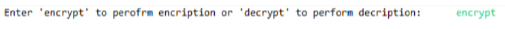
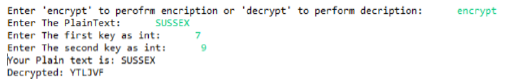

### Cipher Encryption Decryption
 
## My Cipher

------

My algorithm implements two different encrypting/decrypting approaches in which the English letters of plaintext are mapped together into a cipher text. As part of creating my own cipher I have decided to unite monoalphabetic and transposition techniques that will map a perfect cipher that would be hard to decrypt even if the key would be available to a third-party user. My algorithm is based on 3 stages that work sequentially which makes it complex yet simple for a small encryption/decryption algorithm. First stage consist of applying affine method for encryption. Second stage, generating third key to improve affine, applying rivers transposition to the cipher text.

------
#### Note
* The transposition technique is used only in the end of the encryption and at beginning of the decryption

### Affine
For monoalphabetic cipher I have implemented the Affine cipher that is considered as substitution cipher, where each letter in alphabet is mapped to its numeric equivalent. There are two formulas that are used for Affine, one for encryption and other for decryption. It uses modular arithmetic to transform the integer that each plaintext corresponds to into another integer that correspond to a ciphertext letter. (Check formula1)
#### Formula 1

| S | U  |  S |   S |  E | X |
| :------------ |:---------------:| -----:|
| 18  | 20  | 18 | 18 | 4 | 23 |

Affine takes two numeric keys to perform its encryption based on that it uses the formula listed above to perform encryption for each letter of the plain-text, where the ‘a’ and ‘b’ are the first and the second keys and ‘m’ represents the size of the alphabet used, in this case it is 26 for English letters.
As for the decryption, Affine also uses both keys, but to perform decryption it must calculate the inverse modular multiplication. Thus, it uses formula (Check formula2) however to be able and calculate the inverse modular multiplication will only be possible if the first key ‘a’ and number of alphabet ‘m’ (in our case is 26) are coprime such that given the (key * x) mod 26 = 1, where the value ‘x’ will always be different and will be test from 0 to 26 until it finds the exact number that will coprime ‘a’ and ‘m’(check the example in formula3 given the firs key as 17).
#### Formula 2

#### Formula 3

Even if combining monoalphabetic and transposition techniques together was my initial goal I have decided to add something else that would improve the whole idea of monoalphabetic encryption, I came up with this idea after manually testing different substitution ciphers which led me to the point that all the encrypted ciphers by substitution techniques can be easily decrypted using simple
Frequency analysis techniques. For example, using Affine technique only to encrypt the plain-text: ‘SUSSEX’ having first key as 7 and second as 9 will give us cipher text ‘FTFFLO’ from this cipher text we can see that the letter ‘F’ corresponds to the letter ‘S’ that has 3 occurrences in word ‘SUSSEX’, so I presumed that even if I compute transposition technique to it letters will be flipped with their position but each letter will still correspond to the same character of the plain text like in this case ‘S’. So, I have decided to improve my Affine such that it will produce a cipher text that will not correspond to the same characters in the plain text. Besides it’s complexity in calculating formulas I have managed to change it slightly that resulted in a very promising cipher that would not be possible to decrypt using just frequency analysis. When applying the first and second keys along with the plaintext, my cipher generates a third key based on the length of the plain text that will initially be assigned to 0 and be incremented by 2 whenever there is change of a position while encrypting, following that I use my third key inside the formula used to encrypt and decrypt. In this case to encrypt the plain text ‘SUSSEX’ with the same keys of 7 and 9 will be as followed in the steps below.

### Table

### Encryption formula

#### Calculations 1

### Decryption formula

#### Calculations 2 
#### Calculations 3

# Testing my cipher

### To encrypth
For testing MyCipher simply run the project that is zipped along with the report, after compiling it, in the console you will see example of text that will require you to input ‘encrypt’ or ‘decrypt’ for using encryption or decryption. (Please check the example below

The input PlainText must be all capitalized even if it is not my code will return a decrypted message in capitals.
Let’s say we want to perform encryption so we type ‘encrypt’ and follow to the next step where it asks us for the first and the second key(please check example below).

## Note

* The input PlainText must be all capitalized even if it is not MyCipher will still return decrypted message in capitals.
* Please bear in mind that due to complex multiplication of modulo in Java the keys Ideally should not be higher than 100 and both keys should not be ‘even’ or ‘odd’ at the same time. (It is recommended to use key starting from 1 to 30)
* Please also bear in mind that the same keys you input you will need them for the decryption phase along with the encrypted cipher text. So you might need to copy the encrypted cipher text.
* To be able and test decryption you must compile MyCippher project again to start over again where you can input the same keys and the cipher text from the encryption phase

### To decrypth

If you type the ‘encrypt’ or ‘decrypt’ wrong it will show you recompile and try again just like in the example below.

